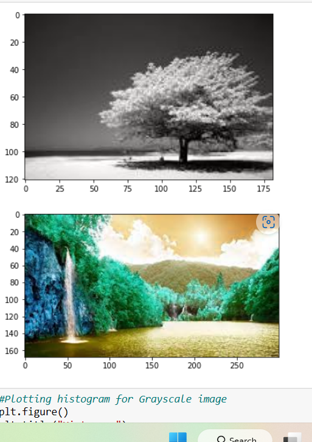
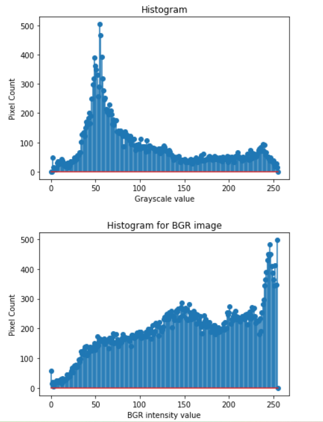
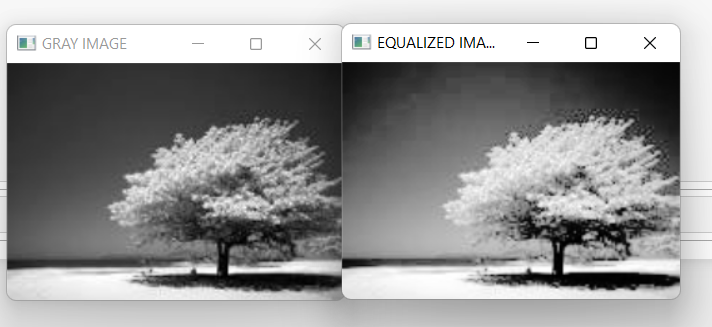

# Histogram and Histogram Equalization of an image
## Aim
To obtain a histogram for finding the frequency of pixels in an Image with pixel values ranging from 0 to 255. Also write the code using OpenCV to perform histogram equalization.

## Software Required:
Anaconda - Python 3.7

## Algorithm:
### Step1:
Read the gray and color image using imread()
### Step2:
Print the image using imshow()
### Step3:
Use calcHist() function to mark the image in graph frequency for gray and color image
### Step4:
cv2.equalize() is used to transform the gray image to equalized form
### Step5:
The Histogram of gray scale image and color image is shown.

## Program:
```python
# Developed By:Nivetha M
# Register Number:212221240034
import cv2
import matplotlib.pyplot as plt
# Write your code to find the histogram of gray scale image and color image channels.
# Histogram for Grayscale image
grayscale_img=cv2.imread("ni.jpg")
plt.imshow(grayscale_img)
plt.show()
hist=cv2.calcHist([grayscale_img],[0],None,[256],[0,255])
# Histogram for BGR image for a single channel
color_img=cv2.imread("je.jpg")
hist1=cv2.calcHist([color_img],[1],None,[256],[0,255])
plt.imshow(color_img)
plt.show()
# Display the histogram of gray scale image and any one channel histogram from color image
#Plotting histogram for Grayscale image
plt.figure()
plt.title("Histogram")
plt.xlabel("Grayscale value")
plt.ylabel("Pixel Count")
plt.stem(hist)
plt.show()
#Plotting histogram for BGR image -Single Channel
plt.figure()
plt.title("Histogram for BGR image")
plt.xlabel("BGR intensity value")
plt.ylabel("Pixel Count")
plt.stem(hist1)
plt.show()
# Write the code to perform histogram equalization of the image. 
#Histogram equalization for Grayscale image
import cv2
Gray_image=cv2.imread('ni.jpg',0)
equalize=cv2.equalizeHist(Gray_image)
#Resizing image 
Gray_image= cv2.resize(Gray_image, (270,190))
equalize= cv2.resize(equalize, (270,190))
#Output
cv2.imshow('GRAY IMAGE',Gray_image)
cv2.imshow('EQUALIZED IMAGE',equalize)
cv2.waitKey(0)
cv2.destroyAllWindows()
```
## Output:
### Input Grayscale Image and Color Image
 
### Histogram of Grayscale Image and any channel of Color Image
 
### Histogram Equalization of Grayscale Image
 
## Result: 
Thus the histogram for finding the frequency of pixels in an image with pixel values ranging from 0 to 255 is obtained. Also,histogram equalization is done for the gray scale image using OpenCV.
